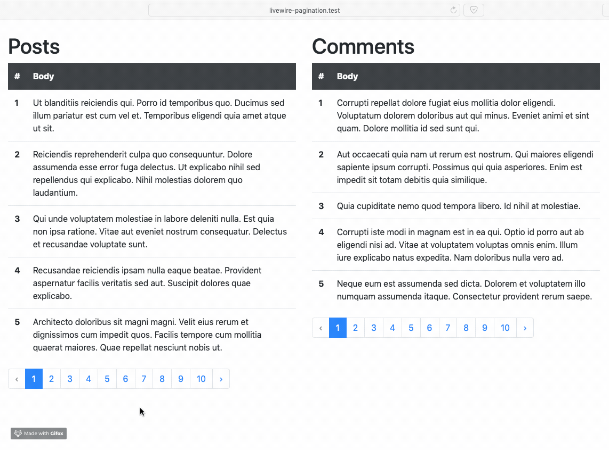
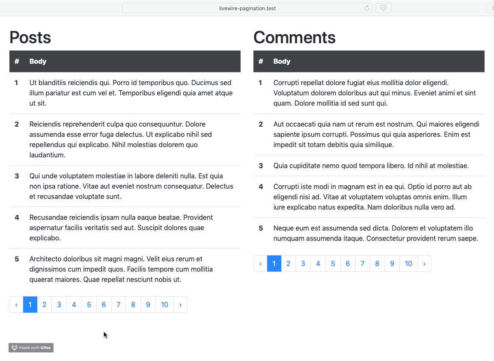

# Livewire-pagination

## The problem

Laravel out-of-the-box can only handle one pagination parameter. So if you have multiple models that have to be paginated, they will all use that same parameter.

E.g. you want to show all Posts and Comments from a user on the same page. You paginate both models. When going to page 2 for Posts, it will also show page 2 for Comments because it uses the same query parameter.

## Livewire Solution
Using Livewire I made two components to seperately load the Posts and Comments. This way you avoid a full page reload and Livewire handles the pagination.

## Improvements

To improve this we should look into creating one pagination component instead of one component for each model/view. As this is my first time using Livewire I don't know if this is possible.

## License

The MIT License (MIT). Please see [License File](LICENSE.md) for more information.
